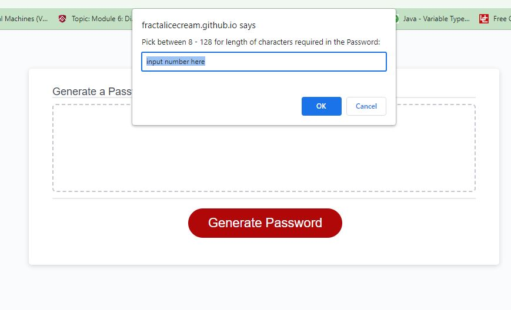
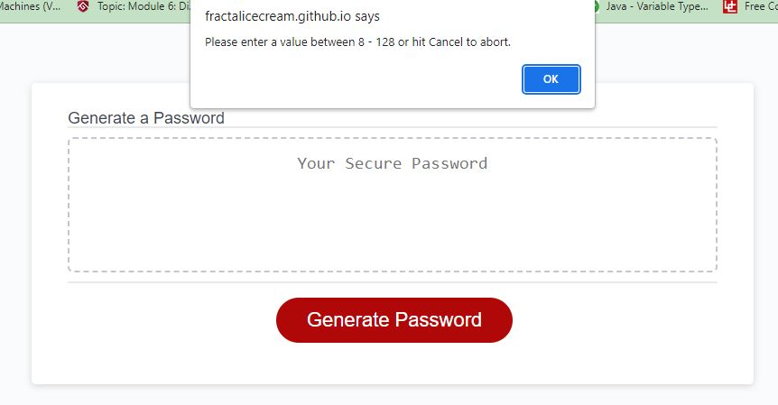
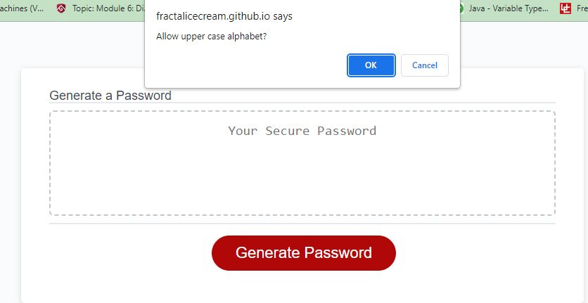
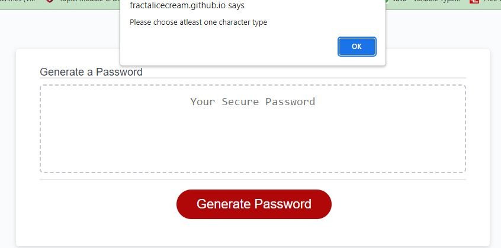
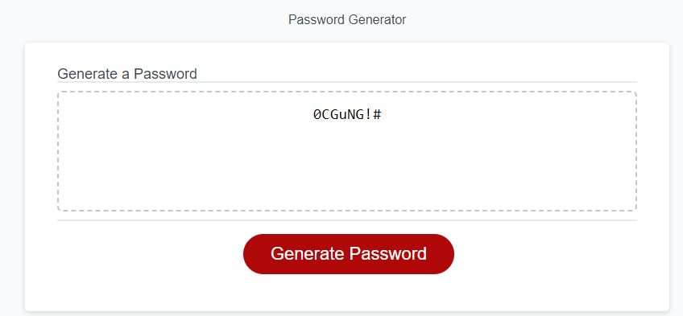

# RandoPasscode

## Description

```
This application tests my knowledge from immediate lessons of Javascript and build the JS code for a password generator. A password generator is a useful
tool to create a unique password. Unique passwords provide more security and help prevent hackers from hard-forcing with easyily thought passwords. This application 
begins with clicking the "Generate Password" button on the webpage and the functions:

- clicking the button executes code with calling the generatePassword function
    - prompt to ask for the length of password (between 8 - 128 characters)
    - prompt to each ask to allow lower case alphabet, upper case alphabet, numbers, and/or special characters
    - the prompts also validate user input and checks for wrong or no inputs and act accordingly
    - also validates of atleast one character type is chosen for the password
    - password is generated and displayed on the web app
```

## Screenshots







## Link

[live web application](https://fractalicecream.github.io/RandoPasscode/)

## User Story

```
AS AN employee with access to sensitive data
I WANT to randomly generate a password that meets certain criteria
SO THAT I can create a strong password that provides greater security
```

## Acceptance Criteria

```
GIVEN I need a new, secure password
WHEN I click the button to generate a password
THEN I am presented with a series of prompts for password criteria
WHEN prompted for password criteria
THEN I select which criteria to include in the password
WHEN prompted for the length of the password
THEN I choose a length of at least 8 characters and no more than 128 characters
WHEN asked for character types to include in the password
THEN I confirm whether or not to include lowercase, uppercase, numeric, and/or special characters
WHEN I answer each prompt
THEN my input should be validated and at least one character type should be selected
WHEN all prompts are answered
THEN a password is generated that matches the selected criteria
WHEN the password is generated
THEN the password is either displayed in an alert or written to the page
```

